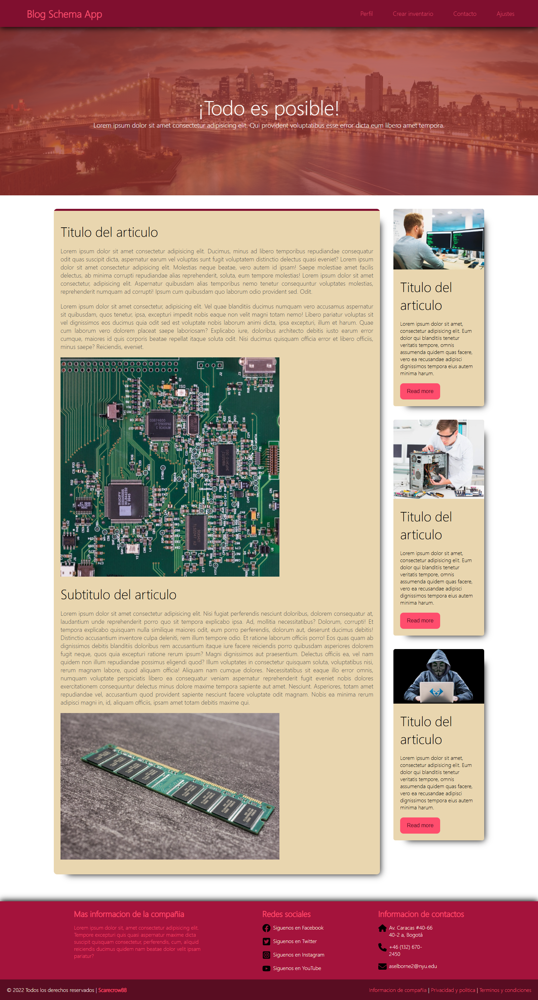
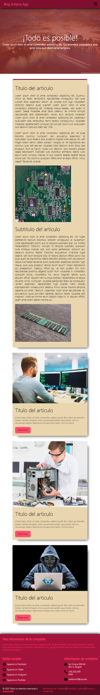
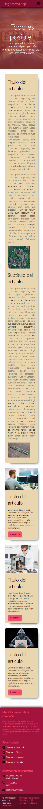

# Blog Schema App
## Funcionalidades
- Vista de esquema de blog
- Responsive
- Alternar menu
## Tecnologías utilizadas
- **Frontend:** JavaScript, CSS
## Arquitecturas
- Monolitica
> Vista 1 de la pagina  
  
> Vista 2 de la pagina  
  
> Vista 3 de la pagina  
  

**Nota:** Antes de salir, pasate a ver las branches